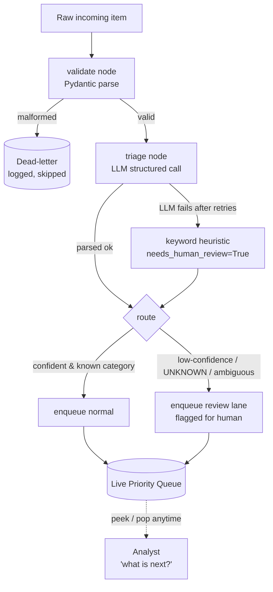

# SOC Next-Best-Action Triage Agent — Solution Overview

> **Audience:** Short meeting / walkthrough. Technical depth is available but the narrative is business-first.

---

## 1. What Problem Does This Solve?

A Security Operations Center (SOC) analyst receives a continuous stream of alerts from many sources: endpoint detection (EDR), log aggregators (SIEM), email gateways, user-submitted tickets. The core operational question is always the same:

> **"Out of everything that just came in, what should I do next?"**

Without automated triage, analysts manually rank items and often miss the urgency signal buried in volume. This prototype automates the triage decision — assigning a severity, a required action, and a confidence — and maintains a live priority queue that an analyst can query at any moment.

---

## 2. Key Assumptions Made Up Front

| Assumption | Rationale |
|---|---|
| **4-tier severity model (Sev1–Sev4)** | Maps to a real-world SOC escalation ladder: production breach → active intrusion → suspicious/unconfirmed → routine |
| **Local LLM (GLM-5.2 via vLLM)** | Data stays on-premises; no cloud API cost or rate limits. The model is a ~744B-parameter MoE, so in practice you point the agent at a shared GPU server |
| **Confidence threshold of 0.6** | Below this, a human must confirm — the cost of a missed Sev1 far exceeds the cost of routing an item to review |
| **FIFO tie-breaking within a severity level** | Deterministic and auditable for v1 — "we processed them in arrival order within the tier" is explainable. Urgency-aware sorting is wired and tested as a one-line switch once the model's scores are validated |
| **Unknown / ambiguous items default to Sev3** | Conservative middle ground: surfaces them above routine noise (Sev4) without crying wolf at the highest level (Sev1) |
| **In-memory queue** | Sufficient for the prototype scope; persistence is called out as the primary production gap |

---

## 3. What Was Developed

A runnable Python CLI + test suite covering the full loop:

```
Generate realistic incoming items
        ↓
Triage each item with a local LLM (structured output)
        ↓
Route by confidence and category
        ↓
Maintain a live priority queue
        ↓
Answer "what's next?" at any moment
```

The deliverable includes:
- **`soc_triage/`** — 9 Python modules (~600 lines of production code)
- **`tests/`** — 13 tests, all passing, runnable fully offline
- **`demo.py`** — shows the full flow including an emergency-jumps-the-queue scenario
- **`eval.py`** — quantitative harness that scores triage quality
- **`README.md`** — operator documentation

---

## 4. Architecture: Two Cleanly Separated Halves

The central design decision is keeping the **cognitive pipeline** and the **operational state** as separate objects.

```
┌─────────────────────────────────────────────────────────┐
│                    LangGraph pipeline                   │
│                    (the "brain")                        │
│                                                         │
│  raw item ──► validate ──► triage ──► route ──► enqueue │
│                  │             │          │             │
│              dead-letter   fallback   review lane       │
└─────────────────────────────────────────────────────────┘
                                              │
                                              ▼  push()
                              ┌───────────────────────────┐
                              │       TriageQueue         │
                              │    (live operational      │
                              │         state)            │
                              │                           │
                              │  peek() → "what's next?"  │
                              │  pop()  → dispatch item   │
                              └───────────────────────────┘
                                              ▲
                              new items keep arriving and
                              landing here via the same graph
```

**Why this split matters:** The queue can be queried at any moment — even while new items are being triaged. A Sev1 arriving mid-stream immediately becomes the answer to "what's next?" without any manual re-sorting.

### Full LangGraph Flow



---

## 5. Module Breakdown

| Module | Role |
|---|---|
| `schema.py` | Priority schema (Sev1–Sev4 definitions) — single source of truth for both generation and triage |
| `models.py` | Typed data contracts: `IncomingItem`, `TriageResult`, `LabeledItem` |
| `llm.py` | `make_chat_model()` factory — returns the real vLLM client or a deterministic mock |
| `generate.py` | Synthetic item generation with controlled coverage and edge injection |
| `triage.py` | Layered LLM call: structured output → JSON fallback → keyword heuristic |
| `queue.py` | `TriageQueue` — `heapq` wrapper with pluggable ordering strategy |
| `graph.py` | LangGraph assembly: nodes, conditional edges, queue injection |
| `demo.py` | Runnable CLI with emergency scenario |
| `eval.py` | Quantitative evaluation harness |

---

## 6. Key Architectural Decisions (with Rationale)

### 6.1 LangGraph for Orchestration

The flow has **branching**:
- valid item vs. malformed (different routes)
- confident triage vs. low-confidence (different queues)
- LLM success vs. failure (different fallback path)

LangGraph models each branch as an explicit conditional edge. A plain LangChain chain would hide this structure inside imperative Python; LangGraph makes it visible, testable, and introspectable. This is the "show the flow" requirement made structural.

### 6.2 The Priority Queue with a Pluggable `key_fn`

The queue is a `heapq` of `(sort_key, sequence_number, item)` tuples. The sort key is produced by an **injected strategy function**:

```python
# v1 — FIFO within severity level (default)
def fifo_key(item: TriageResult) -> tuple:
    return (item.priority_level,)

# v2 — intra-tier urgency (one-line switch, already wired)
def urgency_key(item: TriageResult) -> tuple:
    return (item.priority_level, -(item.urgency or 0.0))

# usage
queue = TriageQueue(key_fn=fifo_key)       # v1
queue = TriageQueue(key_fn=urgency_key)    # v2, no other code changes
```

The **sequence number** is the final tiebreaker — it guarantees items at exactly the same key sort in arrival order, and that Python never falls through to comparing the `TriageResult` payload objects directly (which would fail).

**Emergency re-ordering is free.** With three Sev3s in the queue and a Sev1 arriving, its key `(1,)` sorts above every `(3,)` automatically — the very next `peek()` returns the Sev1. No scan, no manual resort.

```
Queue before emergency:       After Sev1 arrives:
  1. Sev3 — MFA reset           1. Sev1 — ransomware  ← jumped ahead
  2. Sev3 — vendor domain       2. Sev3 — MFA reset
  3. Sev3 — travel alert        3. Sev3 — vendor domain
                                4. Sev3 — travel alert
```

### 6.3 Layered LLM Resilience (Hardened Structured Output)

A local quantized model is less reliable at structured output than a hosted API. Triage never crashes — it degrades:

```
Attempt 1 ──► with_structured_output()    ← tool-calling, typed result
    │
    └─ fails ──► Attempt 2: plain LLM call + JSON parse
                     │
                     └─ fails ──► Attempt 3: strict JSON reprompt
                                      │
                                      └─ fails ──► keyword heuristic
                                                   needs_human_review=True
```

Each network call is wrapped with **tenacity** (3 retries, exponential back-off) for transient connection failures to the vLLM server. The mock model deliberately refuses tool-calling, which forces the test suite to exercise the JSON fallback path — realistic behaviour for a quantized local model.

### 6.4 Provider-Agnostic LLM Factory

```python
def make_chat_model(mock: bool = False, temperature: float = 0.0) -> BaseChatModel:
    if mock:
        return MockChatModel()
    return ChatOpenAI(
        model=os.environ.get("LLM_MODEL", "zai-org/GLM-5.2-FP8"),
        base_url=os.environ.get("LLM_BASE_URL", "http://localhost:8000/v1"),
        ...
    )
```

The rest of the code only ever sees a `BaseChatModel` interface. Switching from GLM-5.2 to any OpenAI-compatible model is two environment variables. Adding a cheap/expensive cascade (fast model for routine items, stronger model for escalations) is a factory change, not a graph change.

### 6.5 Queue Injected via Config, Not Graph State

The `TriageQueue` lives outside the LangGraph state dictionary. It is injected into each graph node through `config["configurable"]["queue"]`. This means:

- **The queue is inspectable at any moment** — not locked inside a node execution
- **New items flow through the graph and land in the same queue** — no synchronisation needed
- **The graph's cognitive logic is pure** — triage decisions don't depend on what's already queued

---

## 7. Safeguards and Failure Handling

Every identified failure mode has a specific route — nothing crashes, nothing is silently wrong.

| Situation | What Happens |
|---|---|
| **Item fits no category** | Triage sets `category="UNKNOWN"`, low confidence → review lane at conservative Sev3, flagged for a human |
| **Item is ambiguous between two levels** | Prompt instructs: pick the more severe, lower your confidence. If confidence < 0.6 → review lane |
| **Low confidence (< 0.6)** | Routed to review regardless of category |
| **Malformed / unparseable item** | Pydantic validation fails in the `validate` node → dead-letter list, pipeline continues |
| **LLM call fails or times out** | Tenacity retries → JSON reprompt → deterministic keyword heuristic, always marked `needs_human_review=True` |

The principle: **under-triage is more dangerous than over-triage.** Ambiguous items are pushed to human review, not silently dropped or auto-escalated.

---

## 8. Synthetic Input Generation

The evaluation and demo need realistic, diverse inputs. The generator runs the LLM with three controls:

- **Forced coverage** — generates N items per severity level to ensure the queue and eval exercise the full Sev1–Sev4 range
- **Deliberate edge injection** — requests ambiguous and off-topic items explicitly, so safeguards are exercised rather than hypothetical
- **No label leakage** — the generator knows the intended severity (used as a weak evaluation label) but the prompt forbids naming it in the text. Without this, triage degrades to string matching and the eval becomes meaningless

A test asserts that no severity label appears in the generated text, protecting the integrity of the evaluation.

---

## 9. Evaluation — "Is the Triage Any Good?"

`eval.py` scores triage's independent decision against the intended severity from generation (weak ground truth, never seen by triage):

| Metric | Why It Matters |
|---|---|
| Exact-level accuracy | The headline number |
| Within ±1 level | Off-by-one is far less dangerous than off-by-three |
| **Sev1 recall** | Missing a real Sev1 is the costly error — tracked separately |
| Cost-weighted error | Under-triage penalised **3×** vs. over-triage |
| % routed to review | Too high → schema too narrow; near-zero with errors → model is overconfident |
| Confusion matrix (Sev1–Sev4) | Shows which levels are being confused |

The asymmetric weighting (3× penalty for under-triage) reflects the real-world consequence: missing a breach is categorically worse than sending a routine request to human review.

---

## 10. What Was Deliberately Deferred

This was scoped to a 1–2 hour prototype. The following are consciously deferred, not forgotten:

| Gap | Production Path |
|---|---|
| In-memory queue (no persistence) | LangGraph checkpointer + durable storage |
| Synchronous, single-process | Async/streaming ingestion so items truly arrive concurrently |
| No Sev4 starvation protection | Add an `aging_key` that promotes long-waiting items — slots into the existing `key_fn` seam |
| Eval uses weak labels (generation's intent) | Hand-labeled gold set + LLM-as-judge scoring action quality |
| Urgency field populated but not used for ordering | Validate `urgency` scores against the eval set, then flip `TriageQueue(key_fn=urgency_key)` — one line, already tested |
| Single model | Cheap/expensive cascade via the `make_chat_model()` factory |
| External integrations stubbed | Wire to real EDR/SIEM APIs at the `generate.py` → `validate` boundary |

---

## 11. How to Run It (30 seconds)

```bash
# install (one-time)
uv sync

# full demo, offline, no model required
uv run python -m soc_triage.demo --mock

# show urgency-aware queue ordering
uv run python -m soc_triage.demo --mock --strategy urgency

# evaluation metrics
uv run python -m soc_triage.eval --mock

# test suite (13 tests)
uv run pytest
```

The `--mock` flag uses a deterministic, network-free model that exercises all code paths including the JSON fallback, the emergency scenario, the dead-letter path, and the failure-to-heuristic degradation.

---

## 12. Quick Reference: Data Contracts

```python
class IncomingItem(BaseModel):
    id: str
    source: str          # "EDR", "SIEM", "email-gateway", "user-ticket"
    text: str            # free-text alert/ticket content

class TriageResult(BaseModel):
    item_id: str
    category: str        # short label, or "UNKNOWN"
    required_action: str # what the analyst should do next
    priority_level: int  # 1 (Sev1, critical) → 4 (Sev4, routine)
    confidence: float    # 0–1; below 0.6 → human review
    rationale: str       # explanation
    needs_human_review: bool
    urgency: float | None  # 0–1 intra-tier signal; reserved for v2 ordering
```

The `urgency` field is populated now so switching the queue's ordering strategy requires no change to the data model or the LLM prompt.
